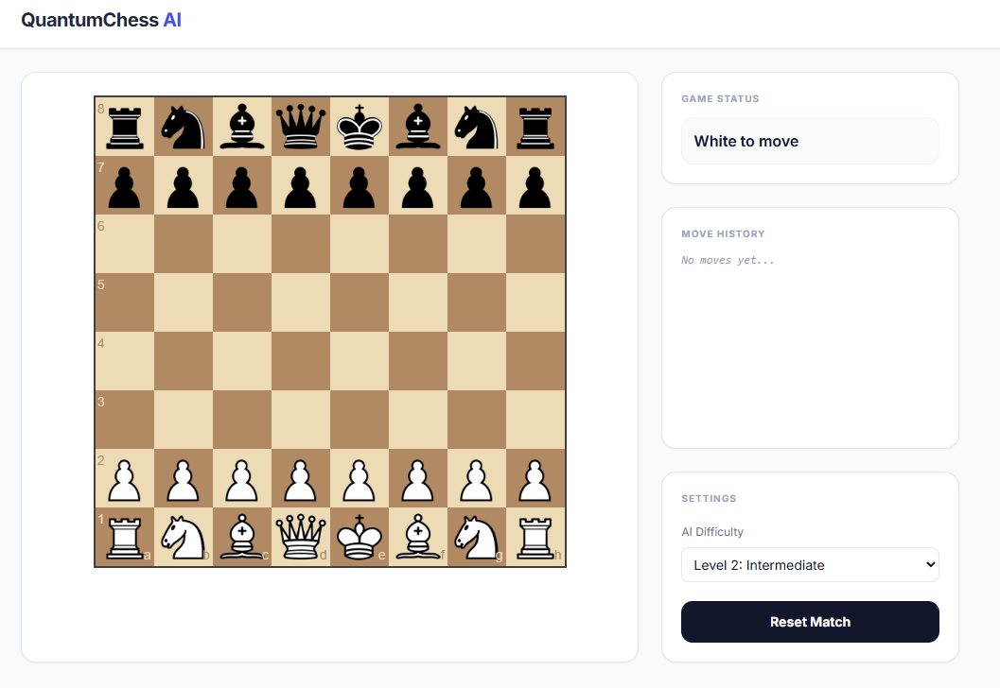
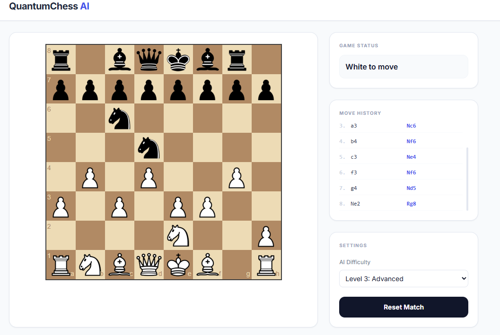
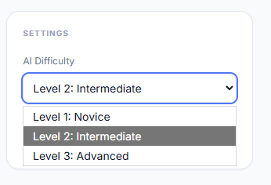

## QuantumChess AI
A high-performance chess engine and web application that bridges classical game theory with modern web architecture. This project demonstrates algorithmic optimization, asynchronous state management, and professional UI/UX design.

## Key Features
- Custom AI Engine: Play against an intelligent opponent powered by a Minimax algorithm with Alpha-Beta pruning.

- Dynamic Move History: Real-time tracking of all moves in Standard Algebraic Notation (SAN).

- Adjustable Difficulty: Multiple AI look-ahead depths to cater to different skill levels (Novice to Advanced).

- Responsive Modern UI: A clean, professional interface built with Tailwind CSS, optimized for both desktop and mobile.

- Legal Move Validation: Full enforcement of chess rules, including castling, en passant, and pawn promotion.

- Instant Feedback: Visual indicators for checks, illegal moves, and AI calculation states.

# Technical Core & Architecture
## Intelligence Engine
The AI is a custom-built engine utilizing:

- Minimax Algorithm: A recursive search algorithm for decision-making, evaluating thousands of potential board states.

- Alpha-Beta Pruning: An optimization technique that drastically reduces the search space, allowing for deeper look-ahead analysis without compromising performance.

- Heuristic Evaluation (PST): Beyond material counting, the engine uses Piece-Square Tables to assess positional advantages, such as center control and king safety.

## System Infrastructure
- Stateful Session Management: Leverages encrypted Flask sessions to handle unique game states (FEN) per user. This ensures that multiple concurrent users can play independent games without server-side state conflicts.

- Asynchronous UI: Built with the JavaScript Fetch API to handle move validation and AI calculation in the background, providing a seamless "Single Page Application" feel.

- Strategic Data Logging: Every move is translated and stored in Standard Algebraic Notation (SAN), demonstrating the ability to handle and visualize complex data logs.

## Interface and User Experience
The application follows modern software design standards:

- Responsive Architecture: Built with Tailwind CSS for a fully responsive experience across mobile and desktop.

- Real-time Feedback Loops: Includes AI "Thinking" indicators and visual validation for illegal moves to maintain high user engagement.

- Accessibility (A11y): Developed using semantic HTML and ARIA standards to ensure compatibility with modern accessibility requirements.

## Development Roadmap
[ ] Integration of Stockfish via WASM for Grandmaster-level difficulty.

[ ] Persistence layer (PostgreSQL) for game analysis and history tracking.

[ ] WebSocket integration (Socket.io) for real-time multiplayer functionality.